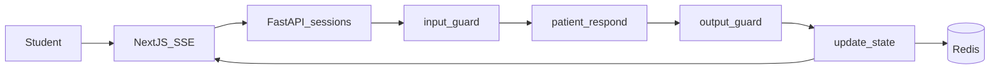

# Clinical Sim Platform — Architecture Reference

## Stack

| Layer | Technology |
|---|---|
| Frontend | Next.js 15 (App Router), React, TypeScript, Tailwind CSS, shadcn/ui |
| Backend | FastAPI, Python 3.12, Pydantic v2, Uvicorn |
| AI orchestration | LangGraph (interview + feedback graphs) |
| Relational DB | PostgreSQL 16 |
| Vector store | pgvector (dev/MVP), Pinecone (prod multi-tenant) |
| Cache / session state | Redis 7 |
| Async jobs | ARQ or Celery (post-session feedback) |

## Directory Layout

```
clinical-sim/
├── apps/
│   ├── web/                    # Next.js frontend
│   └── api/                    # FastAPI backend
│       ├── routers/            # Thin HTTP layer
│       ├── models/             # SQLAlchemy ORM
│       ├── schemas/            # Pydantic DTOs
│       ├── services/           # Business logic
│       └── ai/
│           ├── graphs/         # LangGraph interview graph
│           ├── memory/         # Session store, summarizer, retriever
│           └── guardrails/     # Input/output policies
├── system_prompts/             # Patient personas (YAML, versioned)
│   ├── _base/                  # L0 invariants (immutable without legal review)
│   ├── clinical/
│   ├── organizational/
│   └── educational/
├── evaluation/                 # Feedback agent (separate from patient)
│   ├── graphs/
│   ├── nodes/
│   └── rubrics/
├── packages/
│   ├── core/                   # Domain entities and ports
│   └── specialties/            # Plugin registry per specialty
└── infra/                      # Docker, nginx, seed scripts
```

## LangGraph Placement

| Graph | Location | Purpose |
|---|---|---|
| Interview | `apps/api/ai/graphs/interview_graph.py` | Live chat: input_guard → patient_respond → output_guard → update_state |
| Feedback | `evaluation/graphs/feedback_graph.py` | Post-session: segment → classify → score → narrate |

## Session Memory (3 Levels)

| Level | Storage | Content |
|---|---|---|
| L1 | Redis + PostgreSQL JSONB | LangGraph state: trust_level, topics_disclosed, turn_count |
| L2 | Injected per turn | Last N messages + running summary |
| L3 | pgvector / Pinecone | Patient bible: backstory, triggers, dialogue examples |

## Chat Turn Flow



## L0 Safety Invariants

- Mandatory disclaimer acceptance before access (versioned in DB)
- Persistent UI banner: simulation is educational, not real clinical care
- Virtual patient never diagnoses, prescribes, or gives real medical advice
- Crisis resources visible in footer
- All patient outputs verified by `output_guard` before display

## Key Database Tables

| Table | Purpose |
|---|---|
| `users` | Students, instructors, admins |
| `disclaimer_versions` / `disclaimer_acceptances` | Versioned legal acceptance |
| `patient_profiles` / `profile_versions` | Versioned patient personas |
| `profile_knowledge_chunks` | Vector-indexed patient bible |
| `scenarios` | Assignable training scenarios per specialty |
| `training_sessions` | Active/completed sessions with JSONB state |
| `session_messages` | Full transcript (student, patient, system, guardrail) |
| `rubric_versions` / `feedback_reports` | Versioned evaluation rubrics and generated reports |
| `safety_events` | Guardrail audit log |

## Specialty Extensibility

Add a new specialty (e.g., forensic psychology) by creating folders in:

- `packages/specialties/{specialty}/`
- `system_prompts/{specialty}/`
- `evaluation/rubrics/{specialty}/`

Register in `packages/specialties/registry.py`. Core code does not change.
